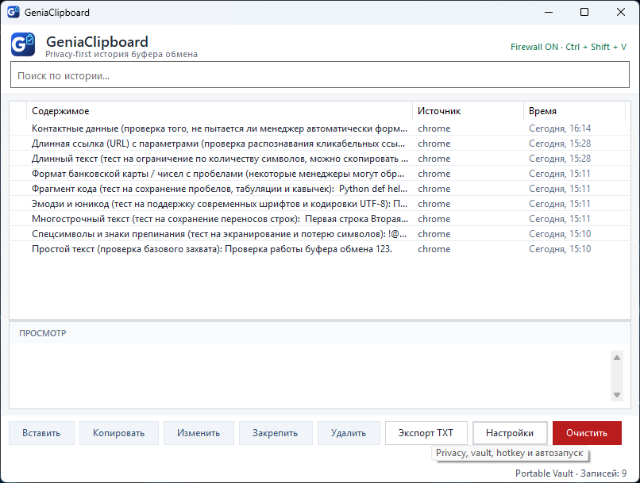
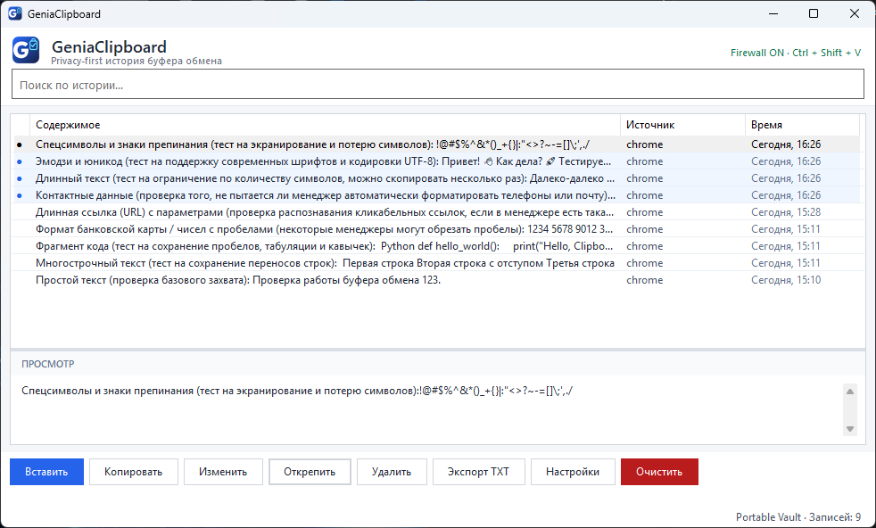
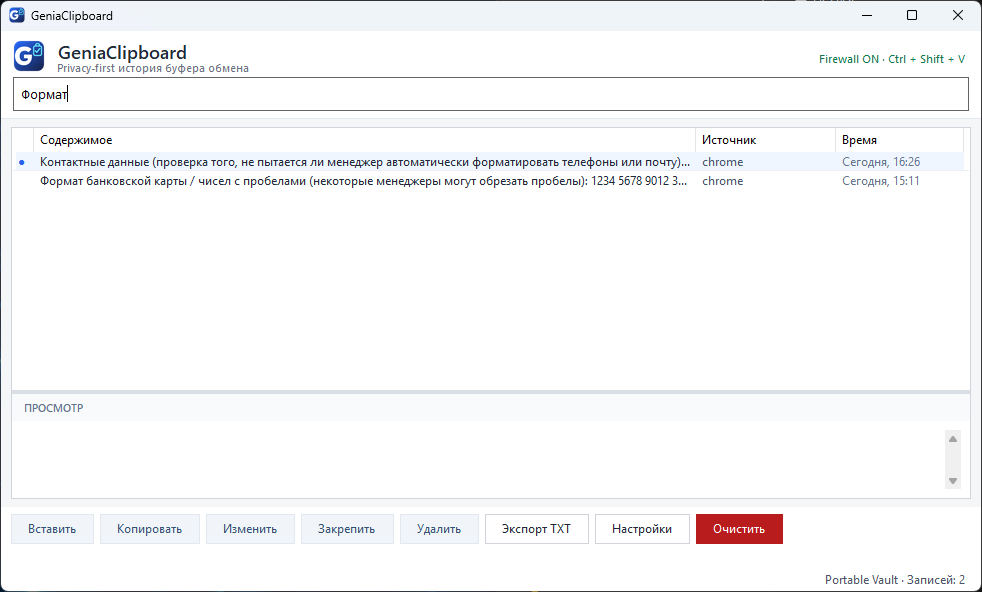
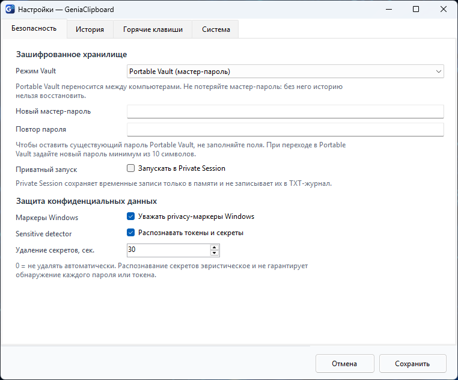
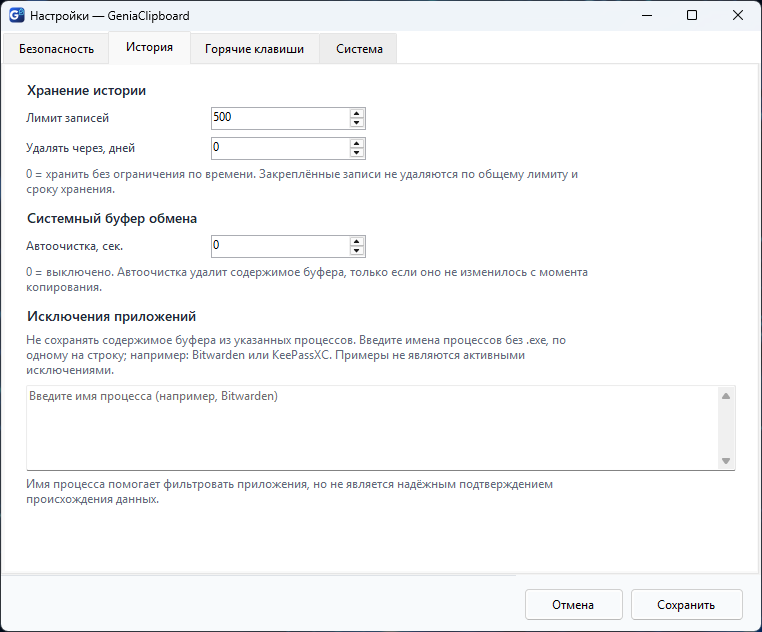
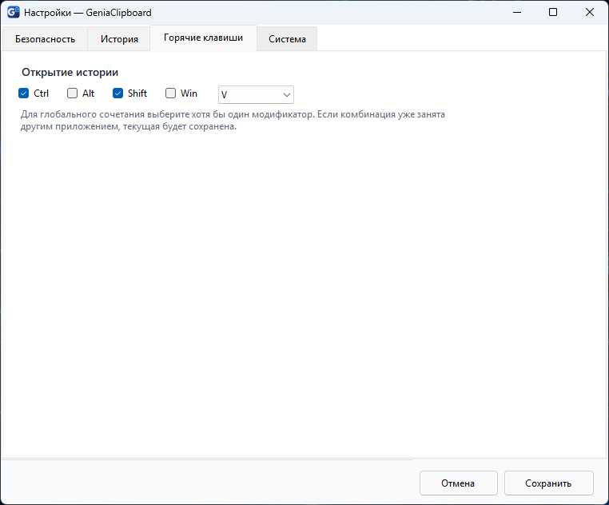
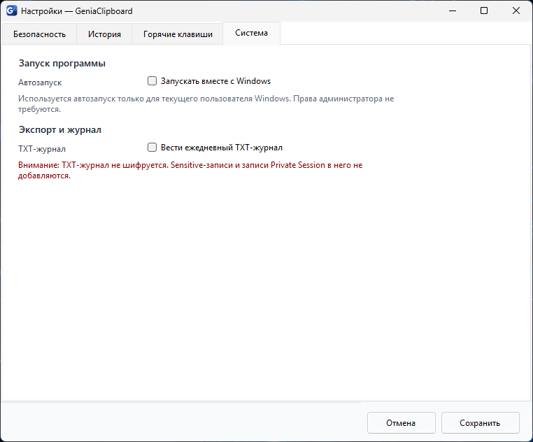
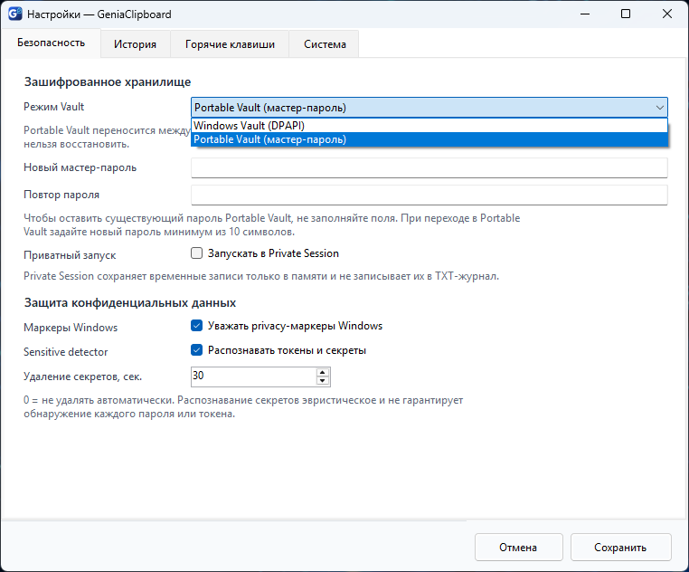
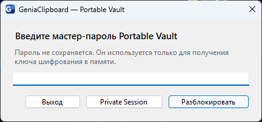

# Screenshots / Скриншоты GeniaClipboard

[Русский ниже](#русский)

All images below are **actual GeniaClipboard 0.5.6 Windows screenshots**, supplied during beta testing on 2026-10-08. No features, dialogs or English labels have been invented. The application UI is currently Russian; [English UI is planned for v0.5.7](https://github.com/geniasoftwin/Genia-Clipboard/issues/10).

## English

### Clipboard history

### Pinning and sensitivity indicators

### Search and filtering

### Security — Portable Vault

### History — retention and application exclusions

<strong>More screenshots: hotkeys, system, Vault selection and unlock</strong>

**Configurable keyboard shortcut**

**Windows autostart and optional plaintext TXT journal**

**Windows Vault (DPAPI) vs Portable Vault (master password)**

**Portable Vault unlock dialog — no password disclosed**

## Русский

На изображениях — **реальная GeniaClipboard 0.5.6 для Windows** с русским интерфейсом. Это не нарисованные макеты и не перевод поверх изображения. Английская локализация включена в [план 0.5.7](https://github.com/geniasoftwin/Genia-Clipboard/issues/10).

| Изображение | Что показывает |
|---|---|
| [Главное окно](screenshots/01-main-history.png) | История скопированного текста, источник, время и предпросмотр |
| [Маркеры записей](screenshots/02-main-pins-and-indicators.png) | Закрепление и чувствительные записи |
| [Поиск](screenshots/03-search-filter.png) | Поиск по истории |
| [Безопасность](screenshots/04-settings-security.png) | Portable Vault и конфиденциальность |
| [История](screenshots/05-settings-history.png) | Лимит и срок хранения, исключения процессов |
| [Горячие клавиши](screenshots/06-settings-hotkeys.png) | Настраиваемый Ctrl + Shift + V |
| [Система](screenshots/07-settings-system.png) | Автозапуск и опциональный TXT-журнал |
| [Два режима Vault](screenshots/08-vault-modes.png) | Windows Vault (DPAPI) / Portable Vault |
| [Разблокировка Vault](screenshots/09-portable-vault-unlock.png) | Ввод мастер-пароля, пустое поле |

**Примечание по конфиденциальности:** в публичную галерею включены только снимки с тестовыми текстами. Снимок редактора с примером контактных данных намеренно не опубликован, пока происхождение этих данных не подтверждено.

---

[Back to English README](../README.md) · [К русскому README](../README_RU.md) · [Report a bug / Сообщить об ошибке](https://github.com/geniasoftwin/Genia-Clipboard/issues/new/choose)
