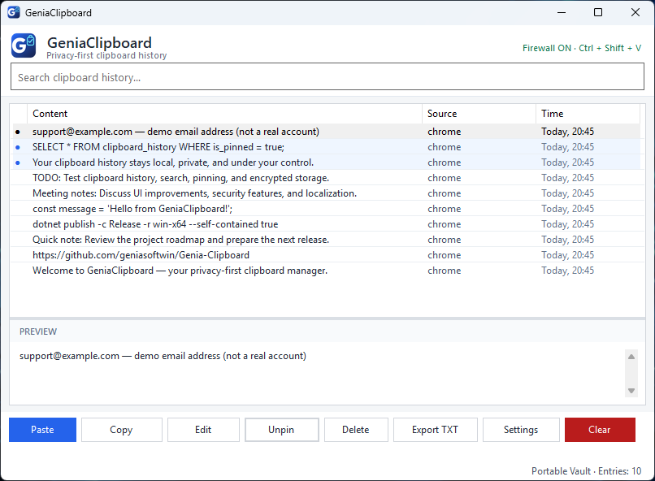
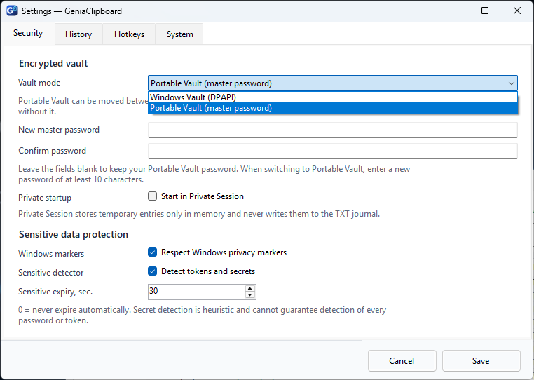
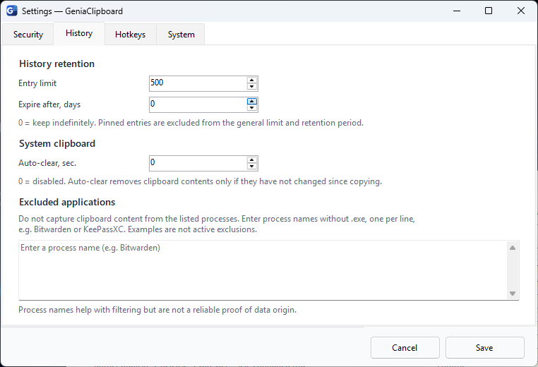
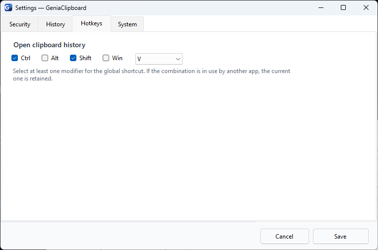
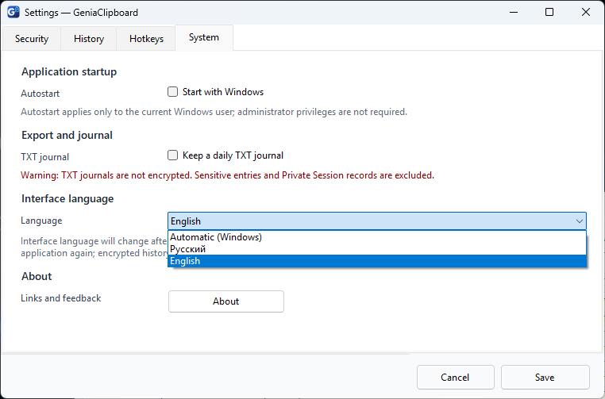

# GeniaClipboard — Screenshots / Скриншоты

All screenshots are **real, unedited Windows application captures**, not rendered mockups. No private credentials or actual master passwords are shown.

There are two different versions here:

- **English 0.5.7 beta:** localization is being tested in [PR #16](https://github.com/geniasoftwin/Genia-Clipboard/pull/16), **not yet a public release**.
- **Russian 0.5.6:** screenshots from the [latest published beta](https://github.com/geniasoftwin/Genia-Clipboard/releases/tag/v0.5.6).

## English v0.5.7 beta — English interface

### Main window — clipboard history

Ten fictional test clips showing history, pin indicators, text preview and paste/copy actions.

### Security — encrypted vault and privacy

Windows Vault / Portable Vault selector, memory-only Private Session, Windows privacy markers and sensitive text detection.

### History — retention, clipboard cleanup and exclusions

<strong>Show Hotkeys and System / Language screenshots</strong>

**Hotkeys — Ctrl + Shift + V**

**System — Windows autostart, TXT journal, Auto / Russian / English selector and About button**

The System screenshot shows **English selected** and the option to follow Windows language automatically. Automatic language behavior: Russian for the Windows `ru` UI locale, English for all other system UI languages. The setting takes effect after a restart.

## Russian v0.5.6 — published interface

These screenshots were captured during public-beta preparation. The current public EXE is still v0.5.6 with a Russian UI.

### Clipboard history

<strong>Show all eight additional Russian UI screenshots</strong>

**Pinned and sensitive indicators**

**Search and filtering**

**Security — Portable Vault**

**History — retention and process exclusions**

**Hotkeys**

**System**

**Vault modes**

**Portable Vault unlock — empty password field**

## Русский

Здесь представлены **две настоящие версии интерфейса**: русская публичная бета 0.5.6 и англоязычная тестовая сборка 0.5.7. Версия 0.5.7 ещё находится в [черновом PR #16](https://github.com/geniasoftwin/Genia-Clipboard/pull/16), поэтому на странице релизов пока предлагается 0.5.6.

| Скриншот английской беты 0.5.7 | Описание |
|---|---|
| [Главное окно](screenshots/en/01-main-history-en.png) | Десять тестовых записей, предпросмотр, вставка |
| [Безопасность](screenshots/en/02-settings-security-en.png) | Portable Vault, Private Session, детектор секретов |
| [История](screenshots/en/03-settings-history-en.png) | Лимиты, очистка, исключения приложений |
| [Горячие клавиши](screenshots/en/04-settings-hotkeys-en.png) | Настройка глобального сочетания |
| [Система и язык](screenshots/en/05-settings-system-language-en.png) | Auto, Русский, English, кнопка About |

Русские снимки 0.5.6 сохранены выше; при выходе официальной 0.5.7 галерею можно обновить, не меняя настоящие оригиналы.

**Приватность:** в снимках использованы демонстрационные тексты (в том числе `support@example.com` как вымышленный пример). Скриншот редактора с отдельными контактными данными по-прежнему не публикуется.

---

[English README](../README.md) · [README на русском](../README_RU.md) · [Issues / Ошибки](https://github.com/geniasoftwin/Genia-Clipboard/issues/new/choose)
